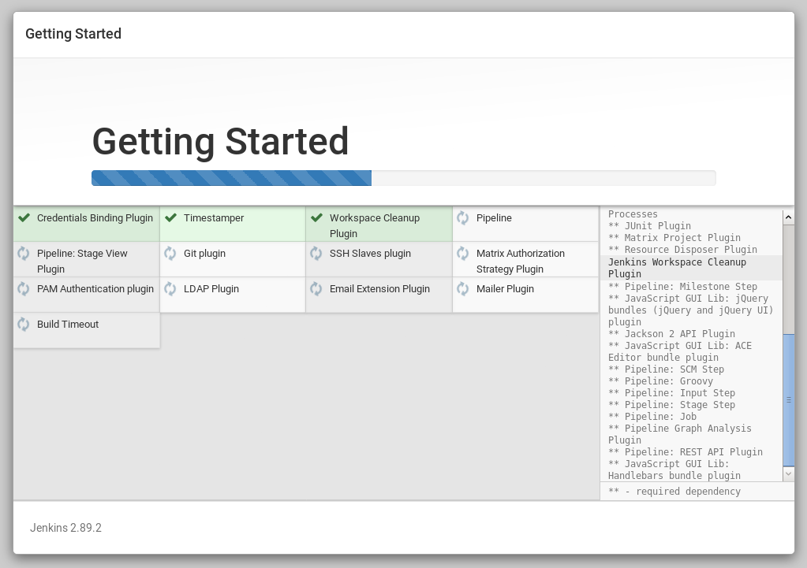

# Continuous Deployment with GitLab and Jenkins

For this part, you should have already done [the second assignment - part 1](02_Assignment_Part_1-Continuous-Integration-and-Continuous-Delivery-GitLab.md).

## Table of Contents
* [Jenkins](#jenkins)
    * [About](#about)
    * [Vagrant Setup](#vagrant-setup)
    * [Add the Jenkins Server VM in Hosts](#add-the-jenkins-server-vm-in-hosts)
    * [Web Setup](#web-setup)
    * [Run a Pipeline](#run-a-pipeline)
* [From Gitlab to Jenkins](#from-gitlab-to-jenkins)

## Jenkins
Jenkins is a tool is mostly used for creating and running complex pipelines which speed up the development process from testing the code to publishing a release package to production environments. In this chapter we'll be setting up our on-premise Jenkins server and work out how to combine GitLab and Jenkins to create a Contiuous Deployment flow.

### About
"Jenkins is a self-contained, open source automation server which can be used to automate all sorts of tasks related to building, testing, and delivering or deploying software." - https://jenkins.io/doc/

Website: https://jenkins.io/


### Vagrant Setup
 > Prerequisites:
 > - you should already have a Vagrant Base Box created as described in [creating-virtual-machines-using-vagrant.md](../extra/creating-virtual-machines-using-vagrant.md));
 > - minimum requirements: 1GiB of free RAM, dual core CPU, ~10GiB of disk space.

Create a new VM dir: `centos-jenkins`. Check the directory structure below.

Create a new directory outside the VM dir that will be used as a shared folder between the host and VMs (e.g. `shared/keys`). Check the directory structure below.

Example of the directory structure (!!! make sure your VMs dir and shared dir are in the same parent dir, otherwise you must change the Vagrantfile file's synced_folder):
```bash
...
├── shared
│   ├── gitlab_jenkins_shared
│   └── keys
└── VMs
    ├── centos-gitlab
...
```

Inside `centos-jenkins`...

Create a `Vagrantfile`:
```bash
# -*- mode: ruby -*-
# vi: set ft=ruby :

Vagrant.configure("2") do |config|
  config.vm.box = "centos-base-box"
  config.vm.synced_folder "../../shared/gitlab_jenkins_shared", "/mnt/rpms", owner: "vagrant", group: "vagrant"
  config.vm.synced_folder "../../shared/keys", "/mnt/keys", owner: "vagrant", group: "vagrant"
  
  config.vm.provision :shell, path: "bootstrap_shared.sh"

  config.vm.define "jenkins.localhost" do |jenkins|
    jenkins.vm.host_name = "jenkins.localhost"
    jenkins.vm.network :private_network, ip: "192.169.0.201", bridge: "enp0s4"
    
    jenkins.vm.provider "virtualbox" do |v|
      v.memory = 512
      v.cpus = 2
      v.customize ["modifyvm", :id, "--cpuexecutioncap", "50"]
    end

    jenkins.vm.provision :shell, path: "bootstrap_master.sh"
  end

  config.vm.define "slave.localhost" do |slave|
    slave.vm.host_name = "slave.localhost"
    slave.vm.network :private_network, ip: "192.169.0.221", bridge: "enp0s4"
    
    slave.vm.provider "virtualbox" do |v|
      v.memory = 256
      v.cpus = 1
      v.customize ["modifyvm", :id, "--cpuexecutioncap", "50"]
    end

    slave.vm.provision :shell, path: "bootstrap_slave.sh"
  end
end
```

Create `bootstrap_master.sh` in the same directory with the Vagrantfile:
```bash
#!/bin/bash

# install jenkins repo
wget -O /etc/yum.repos.d/jenkins.repo https://pkg.jenkins.io/redhat-stable/jenkins.repo
rpm --import https://pkg.jenkins.io/redhat-stable/jenkins.io.key

# jenkins requirements
firewall-cmd --zone=public --add-port=8080/tcp --permanent
firewall-cmd --zone=public --add-service=http --permanent
firewall-cmd --reload

# install jenkins
yum install -y jenkins

# start jenkins
systemctl start jenkins
systemctl enable jenkins

# create ssh key to use for slave node
mkdir -p /var/lib/jenkins/.ssh
ssh-keygen -f /var/lib/jenkins/.ssh/id_rsa -t rsa -N ""
chown -R jenkins:jenkins /var/lib/jenkins/.ssh

# copy public key to keys synced folder 
cp /var/lib/jenkins/.ssh/id_rsa.pub /mnt/keys
```

Create `bootstrap_slave.sh` in the same directory with the Vagrantfile:
```bash
#!/bin/bash

# add master ssh key to authorised_keys for root
mkdir /root/.ssh
cat /mnt/keys/id_rsa.pub >> /root/.ssh/authorized_keys
```

Create `bootstrap_shared.sh` in the same directory with the Vagrantfile:
```bash
#!/bin/bash

# jenkins requirements
yum install -y java-1.8.0-openjdk.x86_64
```

Run `vagrant up`.

 > Don't worry if you get this message `Warning: Remote connection disconnect.` repeatedly. It will take some time until the machines are fully started.

### Add the Jenkins Server VM in Hosts

GNU/Linux
```bash
sudo vim /etc/hosts # add the following line
192.169.0.201 jenkins.localhost
```


Windows
```
# open as Administrator c:\Windows\system32\dirvers\etc\hosts and add the following line
192.169.0.201 jenkins.localhost
```

### Web Setup
Go to http://jenkins.localhost:8080.


Get the password from the Jenkins Server VM created.
```bash
vagrant ssh jenkins.localhost
[vagrant@jenkins ~]$ sudo cat /var/lib/jenkins/secrets/initialAdminPassword
```


Web: Select plugins to install

Uncheck:
- Folders Plugin / cloudbees-folder
- OWASP Markup Formatter Plugin / antisamy-markup-formatter
- Ant Plugin / ant
- Gradle Plugin / gradle
- Subversion Plug-in / subversion

Check:
- Build Pipeline Plugin / build-pipeline-plugin

Install.



Create First Admin User:
- UserName: `admin`
- Full name:` Admin`
- E-mail address: `vagrant@localhost`


Jenkins > Credentials > Jenkins > Global credentials (unrestricted) > Add Credentiuals
- Kind: `SSH Username with private key`
- Scope: `Global`
- Username: `root`
- Private Key: `From the Jenkins master ~/.ssh`

Jenkins > Manage Jenkins > Manage Nodes > New Node
- Node name: `slave1`
- check Permanent Agent
- Remote root directory: `/root/jenkins`
- Labels: `slave1 slave`
- Launch method: `Launch slave agents via SSH`
   - Host: `192.169.0.221` 
   - Credentials: `root`
   - Host Key Verification Strategy: `Non verifying Verification Strategy`


Jenkins > Manage Jenkins > Manage Users > Create User
- UserName: `jenkins`
- Full name:` Jenkins`
- E-mail address: `jenkins@localhost`

Jenkins > New Item
- Item Name: `Deploy`
- Freestyle project

Deploy Configuration:
- This project is parameterized:
   - String Parameter:
      - Name: `PACKAGE_VERSION`
      - Default Value: `none`
- Restrict where this project can be run: `slave1`
- Build
   - Execute shell:
   ```bash
   #!/bin/bash -x
   
   yum remove -y hello-world || echo "nothing to remove"
   yum install -y "/mnt/rpms/hello-world-${PACKAGE_VERSION}-1.el7.centos.x86_64.rpm"
   ```

Jenkins > New Item
- Item Name: `Test`
- Freestyle project

Test Configuration:
- This project is parameterized:
   - String Parameter:
      - Name: `PACKAGE_VERSION`
      - Default Value: `none`
- Restrict where this project can be run: `slave1`
- Build
   - Execute shell:
   ```bash
   #!/bin/bash -x
   
   /home/vagrant/hello-world/hello-world | head -1 | grep -q "Hello, World! Version ${PACKAGE_VERSION}"
   ```

Jenkins > in the `All` view, click on `Deploy` job > Configure:
- Post-build Actions
   - Trigger parameterized build on other projects
      - Projects to build: `Test`
      - Add Parameters: `Current build parameters`

Jenkins > + New View
- View name: `CD`
- check Build Pipeline View

CD Configuration:
- Display Options
   - No Of Displayed Builds: `5`
   - Row Headers: `Include parameters only`

### Run a Pipeline
- Jenkins > `CD` view, click `Run`
- PACKAGE_VERSION: `0.2`

 You should see that both the Deploy job and the Test job are successful. You can look at the console output of each run to see the details.

## From Gitlab to Jenkins
In order to have a continuous workflow, from build to deploy, we have to link GitLab's pipeline with Jenkins' pipeline.

 > Documentation:
 > - https://wiki.jenkins.io/display/JENKINS/Remote+access+API
 > - https://stackoverflow.com/questions/44062737/no-valid-crumb-was-included-in-the-request-jenkins-in-windows

Get `Jenkins` user token from Jenkins app:
- Logout `admin`
- Login with `jenkins`
- From the top right side, click on the **Jenkins** link
- From the left menu, click on **Configure**
- In the right side pane, click on **Show API Token**
- Copy that token somewhere (E.g. `74fd2c03fe6c2f380c74652ba5f8c1a21`)


Get the crumb for the user and machine used to trigger the Jenkins' Job:
- SSH to GitLab VM: `... centos-gitlab]$ vagrant ssh`
- Impersonate GitLab runner: `sudo su - gitlab-runner`
- Request the crumb for jenkins user: `wget -q --auth-no-challenge --user jenkins --password <jenkins_password> --output-document - 'http://192.169.0.201:8080/crumbIssuer/api/xml?xpath=concat(//crumbRequestField,":",//crumb)'`
- Copy the output somewhere (E.g. `Jenkins-Crumb:62f29d57d1933b96ee3b2c4ef88f1bc6`)


Set up a deploy stage on GitLab, to trigger the Jenkins Deploy job:
- In GitLab, in hello-world repo, edit the .gitlab-ci.yml and add the deploy stage. The final result should be like this:
```yaml
stages:
  - test
  - build
  - deploy

helloworld_test_job:
  stage: test
  script:
    - rm -rf ./src
    - shopt -s extglob

    - export GOINSTALLPATH="/usr/local/go"
    - export GOPATH="$(pwd .)/hello-world"
    - rm -rf "${GOPATH}"
    - mkdir -p "${GOPATH}"

    - export PATH="${PATH}:${GOINSTALLPATH}/bin:${GOPATH}/bin"

    - export HELLOWORLDSRCPATH="${GOPATH}/src/gitlab.localhost/vagrant/hello-world"
    - mkdir -p "${HELLOWORLDSRCPATH}"

    - cp -R !(helloworld.spec|README.md|hello-world|src) "${HELLOWORLDSRCPATH}"
    - go get github.com/golang/lint/golint github.com/GeertJohan/fgt

    - cd "${HELLOWORLDSRCPATH}"
    - go vet $(go list ./... | grep -v /vendor/)
    - exit_code=0; while read line; do fgt golint $line || exit_code=1; done < <(find * -type f -name '*.go' -not -wholename 'vendor/*' -not -wholename 'Godeps/*'); if [ $exit_code -ne 0 ]; then exit $exit_code; fi
    - exit_code=0; while read line; do go test -race "${line}" || exit_code=1; done < <(find * -type f -name '*_test.go' -not -wholename 'vendor/*' -not -wholename 'Godeps/*' | sed -r 's#^(.*)/[^/]+$#gitlab.localhost/vagrant/hello-world/\1#g' | sort | uniq); exit $exit_code

helloworld_el7_build_job:
  only:
    - master@vagrant/hello-world
  stage: build
  script:
    - sed s/0.1/$CI_BUILD_REF_NAME/ -i helloworld.spec
    - sed "s/\"0.1\"/\"$CI_BUILD_REF_NAME\"/" -i main.go
    - rm -rf ~/rpmbuild/
    - rpmdev-setuptree
    - shopt -s extglob
    - mkdir -p ~/rpmbuild/BUILD/src/gitlab.localhost/vagrant/hello-world
    - cp -R !(helloworld.spec|README.md|go) ~/rpmbuild/BUILD/src/gitlab.localhost/vagrant/hello-world
    - rpmbuild -bb helloworld.spec
    - mv ~/rpmbuild/RPMS/x86_64/*.rpm /mnt/rpms
  tags:
    - el7
  only:
    - /^[0-9]+\.[0-9]+$/
  except:
    - branches

helloworld_el7_deploy_job:
  only:
    - master@vagrant/hello-world
  stage: deploy
  script:
    - |
      curl -X POST "http://192.169.0.201:8080/job/Deploy/build" --user "jenkins:74fd2c03fe6c2f380c74652ba5f8c1a21" --data-urlencode json="{\"parameter\": [{\"name\": \"PACKAGE_VERSION\", \"value\":\"$CI_BUILD_REF_NAME\"}]}" -H "Jenkins-Crumb:62f29d57d1933b96ee3b2c4ef88f1bc6"
  tags:
    - el7
  only:
    - /^[0-9]+\.[0-9]+$/
  except:
    - branches
```

 > Note:
 > - at `--user "jenkins:74fd2c03fe6c2f380c74652ba5f8c1a21"`, that hash is the user's token saved earlier
 > - at `-H "Jenkins-Crumb:62f29d57d1933b96ee3b2c4ef88f1bc6"`, the hash is the crumb generated on GitLab machine


In GitLab, create a new tag (e.g. `0.3`)

Check the GitLab pipeline results at `http://gitlab.localhost/vagrant/hello-world/pipelines`. The whole pipeline should be successful.

 > Note that these GitLab jobs are not perfect. It's just the minimum to make everything working. For example, in the helloworld_el7_deploy_job, there is no HTTP response check, and this could lead to false positives.


In Jenkins, check the CD view for a new pipeline run: `http://jenkins.localhost:8080/view/CD/`. You should see that both the Deploy job and the Test job are successful. You can look at the console output of each run to see the details.

 > Note that the Jenkins jobs are not perfect, either. For example, none of the two jobs are validating the PACKAGE_VERSION; we can run the Test jobs with no version and it will be successful.


This is it. After creating a new tag, the automated system made some tests, built a package, deployed that package into another environment and test that the expected app is there. By making all this, we implemented a rudimentary Continuous Deployment system.
